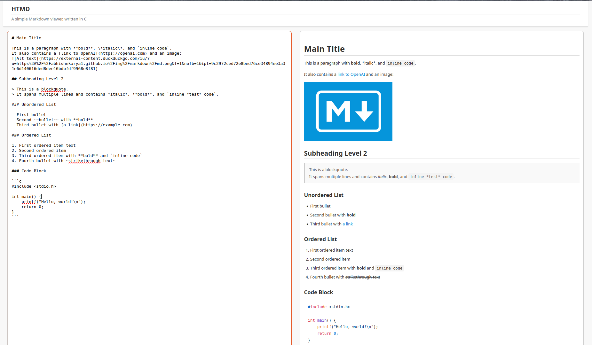

# HTMD

A simple Markdown to HTML converter and viewer.


## Usage

### CLI
To use the cli program to convert `.md` files to `.html`, compile
```makefile 
make cli
```
and simply run the executable.

### Website
To use the live convertion server, first compile with
```makefile 
make wasm
```
which creates a wasm module using emscripten.  
To start the server, run:
```terminal
cd site
python3 -m http.server 6969
```
and open `localhost:6969` in your webbrowser.

## Known Issues
- no nested lists
- no code block language detection
